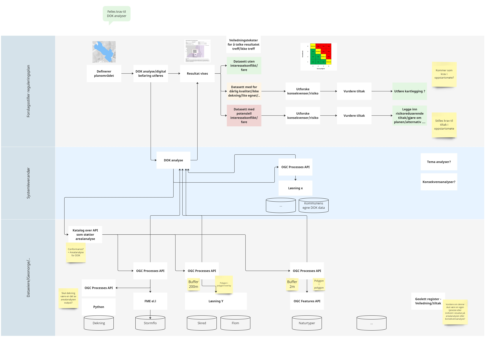

# Bakgrunn
Kommunal- og distriktsdepartementet bestilte i 2023 at Kartverket skulle utvikle nasjonalt standardisert opplegg for DOK-arealanalyse. Slike analyser varierer i dag i innhold og gir ulike svar fra ulike systemleverandører og etater. I arealplanlegging og byggesak er det ønske om forutsigbare prosesser og at aktørene har samme kunnskapsgrunnlag og dokumentasjon. Med standardisert opplegg for arealanalyse vil analyseresultater fra ulike tilbydere kunne sammenlignes, analyser vil dokumenteres og vil kunne være etterprøvbare. Det standardiserte opplegg fokuserer på både teknisk og faglig samordning av innholdet i analysene. 

Prosjektet startet opp under [tiltak 50 - Arealanalyser](https://www.geonorge.no/Geodataarbeid/nasjonal-geodatastrategi/handlingsplanens-tiltak/tiltak-50/) i nasjonal geodatastrategi sin handlingsplan og er nå videreført under [tiltak 3 - Heve kvaliteten på det offentlige kartgrunnlaget(DOK)](https://www.geonorge.no/Geodataarbeid/nasjonal-geodatastrategi/handlingsplanens-tiltak/tiltak-3/) og [aktivitet 2 - DOK arealanalyse](https://tiltaksplan.geonorge.no/tiltak/3/aktivitet/2).

Presentasjon for systemleverandører 4. desember 2023: [DOK-arealanalyse_desember2023.pdf](https://github.com/kartverket/DOK.Arealanalyse.spesifikasjon/blob/main/documents/DOK%20-%20Arealanalyse-2023-2024-Kartverket.pdf)

# Arealanalyser
Kartverket har utviklet opplegget ved bruk av Arkitektum AS som konsulent. Kommuner og andre brukere, samt systemleverandører som tilbyder av analyseløsninger har vært med i prosessen. Arbeidet med det standardiserte opplegget fortsatt i 2024, og en første versjon av standardisert opplegg ble publisert i februar 2025 [Nasjonal spesifikasjon for DOK arealanalyse v1.0](https://www.kartverket.no/globalassets/geodataarbeid/dok-og-temadataarbeid/dok-arealanalyse-spesifikasjon-v1.0-kartverket2025.pdf)
Implementering og videreutvikling skjer i tett dialog med relevante aktører og brukere, inkludert systemleverandører, kommuner, KS, DiBK mfl. Målet er å teste metodikken gjennom implementasjon hos minst en pilotkommune. Kartverkets videre arbeid knyttes også til prosjektet Geolett, som pågår i perioden 2023–2026.

Prosjektmål:
Beskrive en standardisert metode for DOK-arealanalyse, med mål om å oppnå mer enhetlige analyser på tvers av kommuner og systemleverandører

Spesifikasjonen har to hovedelementer:
1.	Metodebeskrivelse – en faglig beskrivelse av hvordan analysen skal gjennomføres.
2.	Spesifikasjon av teknisk oppsett – hvordan analysen kan implementeres hos brukere.

DOK Arealanalyse kan implementeres som en lokal løsning hos en etat, kommune mv, eller kan tilbys fra systemleverandører mv. DOK Arealanalyse kan integreres i brukerløsninger innen plan, byggesak mv, eller kan etableres som et frittstående brukersystem.

## KS veikart
Tiltak T-2.5 i KS sitt veikart for plan-, bygg- og geodataområdet tar sikte på å utvikle krav til en felles DOK-analyse, ofte referert til som en «standardisert områdeanalyse». Målet er å legge til rette for standardiserte DOK-analyser som vurderer alle relevante DOK-datasett for en gitt tiltakstype, og presenterer informasjonen på en enkel og forståelig måte for den aktuelle eiendommen eller planområdet. Dette tiltaket er nært knyttet til tiltak 2.3, som fokuserer på å sikre gode og tilgjengelige DOK-datasett. 

Innføringen av nasjonale retningslinjer for DOK-analyse vil bidra til at relevante DOK-data blir mer tilgjengelige og standardiserte på tvers av prosjekter og kommuner. En strukturert og enhetlig presentasjon av dataene vil gjøre det enklere for næringsliv, innbyggere og saksbehandlere å være selvbetjente. Standardiseringen av DOK-analysene vil også sikre en ensartet form med kvalitetssikrede datasett.

For KS vil DOK-arealanalyser bidra med en teknisk spesifikasjon som kan brukes som krav i [Nasjonal produktspesifikasjon for plan- og byggesak](https://www.ks.no/fagomrader/digitalisering/felleslosninger/verktoykasse-plan--og-byggesak/verktoy/nasjonal-produktspesifikasjon-plan--og-byggesak/)

## Geolett
Prosjektet bygger videre på resultatene fra Geolett 1 og vil benytte veiledningstekster og tjenester fra [geolett register](https://register.geonorge.no/geolett). I Geolett 2 videreføres dette arbeidet med følgende overordnede mål:
* Helhetlig plan- og byggesaksprosess: Sikre at prosessen oppleves sammenhengende for alle brukere, inkludert innbyggere, næringsliv, frivillige organisasjoner og offentlige virksomheter, uavhengig av hvilken kommune eller sektormyndighet som er involvert.
* Smidige prosesser: Unngå at brukerne må oppgi informasjon som allerede er innhentet av sektormyndigheter og kommuner i plan- og byggesaksprosessen.
* Tilgjengeliggjøring av data: Sikre at sektormyndighetene deler ikke-skjermede data på en måte som egner seg for digital selvbetjening og viderebruk i nye tjenester, noe som kan bidra til verdiskaping i næringslivet.
* Datadeling på tvers: Utvikle metodikk, prinsipper og rammeverk som støtter datadeling på tvers, og dermed skape et felles økosystem for nasjonal digital samhandling innen plan- og byggesaksområdet.
* Sammenhengende tjenester: Utvikle tjenester som fungerer på tvers av sektorer og forvaltningsnivåer, og som ivaretar både kommunale og statlige behov.

Innenfor rammen av Geolett 2 vil DOK-arealanalyser kunne bidra til en standardisert metode for levering av slike analyser fra sektormyndigheter. Dette vil understøtte målene om enhetlige og effektive prosesser i plan- og byggesaksbehandlingen. 

## Teknologisk rammeverk for den geografiske infrastrukturen
DOK Arealanalyser ligger under [Prosesseringstjenester i teknologisk rammeverk](https://dokument.geonorge.no/styrendedokumenter/nasjonalt-rammeverk-for-geografisk-informasjon/rammeverksdokumentet/teknologisk-rammeverk-for-den-geografiske-infrastrukturen/4.0/teknologiskrammeverkhtml.html#_prosesseringstjenester) og anbefaling 83 er relevant å kunne støtte i DOK arealanalyser.

83. Ofte brukte analyser av høy samfunnsmessig betydning bør implementeres som tjenester og dokumenteres i Geonorge, slik at en unngår å måtte laste ned hele databaser samt sikre at en bruker oppdaterte data som utgangspunkt for analyser. Dataeier bør tilby analysetjenester (WPS) som f.eks om tiltak berører eller er i nærheten av data som inngår i de datasett som kommunen har bekreftet inngår i DOK. Det er dataeier som har best kunnskap om sine data og bruken av disse i tjenestene.
Eksempler på analyse:
* Avstand til kvikkleire
* Avstand fra 50 års flom/100 års flom
* Avstand fra kulturminner
* Berører antikvariske bygg

## DOK-Arealanalyse spesifikasjon
Dette er utkast/forslag til standard for DOK-arealanalyse. 

### Skisser til TO BE arkitektur

### Teknisk dokumentasjon - OGC Processes API
Se [Spesifikasjon](spec.md)

### Demonstrator
En demonstrator/POC for å teste ut API for DOK arealanalyser er tilgjengelig på https://dok-arealanalyse.azurewebsites.net/.

Her er eksempler på områder som kan brukes som analyseområde i demonstrator:
* [Stormflo skien havn](demonstrator/stormflo_havn.geojson)
* [Arealplan His allè i Arendal](demonstrator/arealplan_his-alle.geojson)
* [Flom i drammen](demonstrator/flom_drammen.geojson)

### Liste over avklaringer legges under Issues
